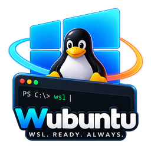
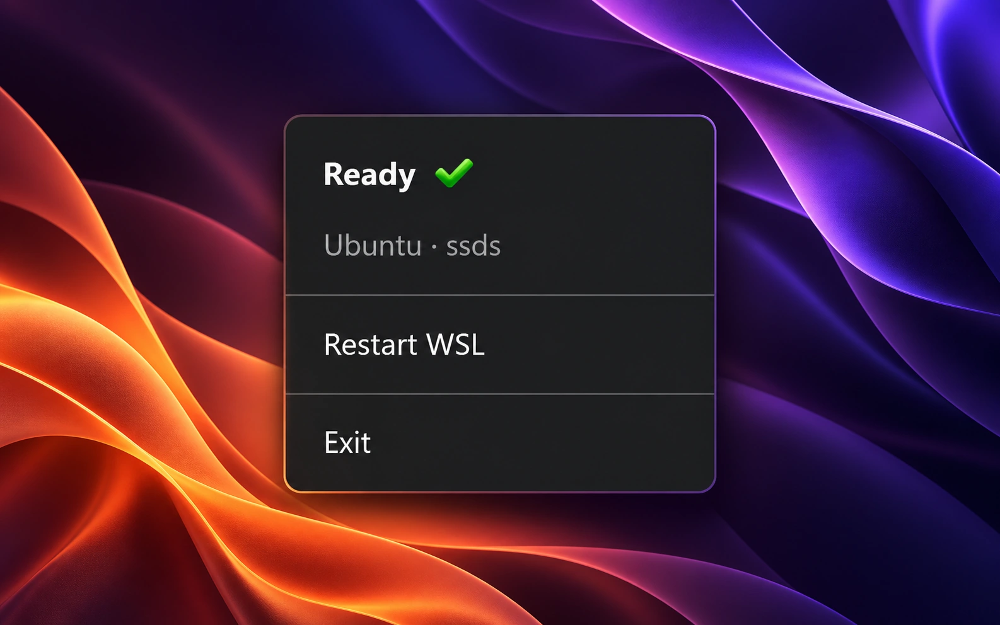

<h1 align="center">
  
</h1>

**One less terminal to keep open.**

There’s a terminal window sitting somewhere on your desktop. You’re not using it. It’s just there to keep Ubuntu running.

Wubuntu takes that little job off your hands.

It starts Ubuntu in WSL, keeps it running in the background, and checks whether SSH responds. You get a small icon in the Windows tray and can get on with your work.

  

## Why it exists

I wanted a simple way to keep Ubuntu running while working through SSH with tools like Codex. A place to check its status and restart it when needed.

That felt like a job for a tray icon.

Wubuntu is deliberately small. Open it when you need Ubuntu. Check on it when something feels wrong. The rest of the time, it should be easy to forget it’s there.

## Get started

You’ll need 64-bit Windows with .NET Framework 4.8. 
Have Ubuntu set as your default WSL distribution, with SSH configured to start alongside it.

1. Download the ZIP.
2. Extract it to a folder you can write to.
3. Run `Wubuntu.exe`.

Look for the icon beside the clock. It may be in the tray overflow.

## In the tray

  

Right-click the icon to open the menu.

- **Ready** - Ubuntu is running and SSH responds inside it.
- **Restart WSL** - restarts Ubuntu.
- **Exit** - stops Ubuntu and closes Wubuntu.

**Restart and Exit stop all processes and SSH connections in that Ubuntu distribution. Save your work first.**

If something goes wrong, click the status to open the log and [open an issue](https://github.com/imssds/wubuntu/issues).

[MIT License](https://github.com/imssds/wubuntu/blob/main/LICENSE)
